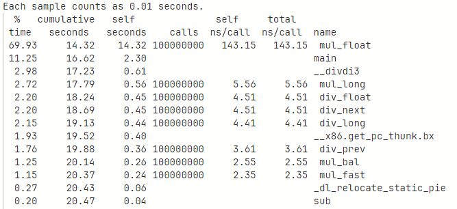
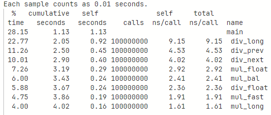

# 실전코딩 기말 프로젝트

## 이준서

## 201921115

## 목차
- [1. 프로젝트 요약](#1--------)
- [2. 고정소수점 fx_S1318 소개](#2-------fx-s1318---)
- [3. 프로젝트 파일 설명](#3-----------)
- [4. 정밀도 및 구현 분석](#4------------)
- [5. 속도 분석](#5------)

## 1. 프로젝트 요약
    아주대학교 실전 코딩2 최종 프로젝트를 위해 제작된 프로젝트로,
    임베디드 시스템을 위한 효율적인 고정소수점 수학 라이브러리 개발을 목표로 한다.
* 이 프로젝트는 부호를 갖고, 정수 13자리와 소수점 이하 18자리를 갖는 고정소수점으로 수를 표현한다.
* 곱셈과 나눗셈은 여러 방식으로 표현하여 경우에 따라 알맞게 사용할 수 있도록 설계했다.

## 2. 고정소수점 fx_S1318 소개
#### fx_S1318의 구조

| FX_SYSTEM | Sign Bits | Integer Bits | Fractional Bits |
|:---------:|:---------:|:------------:|:---------------:|
|  fx_S1318 |     1     |      13      |        18       |

#### fx_S1318의 특징

|                  |            Dec            |     How to Calc    |
|:----------------:|:-------------------------:|:------------------:|
|   Maximum Value  | 8191.99999618530273437500 | 0x7fffffff / 2^18  |
|   Minimum Value  |           -8192           |  0x10000000 / 2^18 |
| Minimum Interval |   0.00000381469726562500  |  0x00000001 / 2^18 |

* 최대값은 sign bit를 제외하고 모두 1인 상태에서 2<sup>18</sup>으로 나눈 값이다.
* 최소값은 sign bit만 1인 상태에서 2<sup>18</sup>으로 나눈 값이다.
* 최소 간격은 1을 2<sup>18</sup>으로 나눈 값이다.

## 3. 프로젝트 파일 설명
#### main.c
* 간단한 사칙연산 및 삼각함수 degree 계산을 소개한다.
#### fx_S1318.h
* header file이고, 다양한 MACRO와 Extern Function을 포함한다.
* Macro: 계산의 편의를 위한 매크로

|    MACRO   |    VALUE   |                     DESCRIPTION                     |
|:----------:|:----------:|:---------------------------------------------------:|
| FX_S_13_18 |    -1318   |        sign bit, number of int and float bits       |
|  FX_SYSTEM | FX_S_13_18 |                     system type                     |
|    __M64   |      1     |                  for 64bits compile                 |
|  FX_Q_NUM  |     18     |                 number of float bits                |
|  FX_Q_HALF |      9     |              half number of float bits              |
|  FX_Q_VAL  |   262144   |                   int type of 2^18                  |
|  FX_Q_FVAL |  262144.0f |                  float type of 2^18                 |
|     PI     |  3.141592  |       value of PI behind the decimal 6 points       |
|    Euler   |  2.718281  | value of Euler constant behind the decimal 6 points |
|    log2    |  0.693147  |                   number of log(2)                  |
|    ln10    |  2.302585  |                   number of ln(10)                  |
|    sqrt2   |  1.414214  |               number of square root(2)              |
|    sqrt3   |  1.732051  |               number of square root(3)              |

#### fx_S1318.c
* Conversion Fuction: fixed를 다른 타입으로, 혹은 다른 타입에서 fixed로 변환하는 함수

|          FUNCTION          |              RETURN              |     TYPE CASTING    |
|:--------------------------:|:--------------------------------:|:-------------------:|
|   fixed fromChar(char f)   |   (fixed) (f * (1 << FX_Q_NUM))  |  char → fixed(int)  |
|    fixed fromInt(int f)    |   (fixed) (f * (1 << FX_Q_NUM))  |   int → fixed(int)  |
|  fixed fromFloat(float f)  |   (fixed) (f * (1 << FX_Q_NUM))  |  float → fixed(int) |
| fixed fromDouble(double f) |   (fixed) (f * (1 << FX_Q_NUM))  | double → fixed(int) |
|    char toChar(fixed x)    |  (((char) x) / (1 << FX_Q_NUM))  |  fixed(int) → char  |
|     int toInt(fixed x)     |   (((int) x) / (1 << FX_Q_NUM))  |   fixed(int) → int  |
|   float toFloat(fixed x)   |  (((float) x) / (1 << FX_Q_NUM)) |  fixed(int) → float |
|  double toDouble(fixed x)  | (((double) x) / (1 << FX_Q_NUM)) | fixed(int) → double |

* Calculating Function: 사칙연산을 위한 함수

|              FUNCTION             |                               RETURN                               |
|:---------------------------------:|:------------------------------------------------------------------:|
|    fixed add(fixed a, fixed b)    |                                a + b                               |
|    fixed sub(fixed a, fixed b)    |                                a - b                               |
| fixed mul_float(fixed a, fixed b) |             (fixed) ((float) a * (float) b / FX_Q_FVAL)            |
|  fixed mul_bal(fixed a, fixed b)  |                ((a >> FX_Q_HALF) * (b >> FX_Q_HALF))               |
|  fixed mul_fast(fixed a, fixed b) |                        ((a * b) >> FX_Q_NUM)                       |
|  fixed mul_long(fixed a, fixed b) |        (fixed) (((long long) a * (long long) b) >> FX_Q_NUM)       |
| fixed div_float(fixed a, fixed b) |      b != 0 ? (fixed) (FX_Q_FVAL * (float) a / (float) b) : 0      |
|  fixed div_prev(fixed a, fixed b) |                 b != 0 ? ((a << FX_Q_NUM) / b) : 0                 |
|  fixed div_next(fixed a, fixed b) |                 b != 0 ? ((a / b) << FX_Q_NUM) : 0                 |
|  fixed div_long(fixed a, fixed b) | b != 0 ? (fixed) (((long long) a << FX_Q_NUM) / (long long) b) : 0 |

* sinTable Array: 삼각함수 연산을 위한 배열, F_Q_VAL을 곱한 값으로 세팅
```
float sinTable[91] = {
	0,4574.4128,9148.8256,13720.61696,18287.16544,22848.47104,27401.91232,31947.48928,36482.58048,41007.18592,
	45521.3056,50019.69664,54502.35904,58969.2928,63417.87648,67848.11008,72257.37216,76643.04128,81007.73888,85346.22208,
	89658.49088,93944.54528,98201.76384,102427.5251,106624.4506,110787.2973,114916.0653,119010.7546,123068.7437,127090.0326,
	131072,135014.6458,138915.3485,142774.1082,146588.3034,150360.5555,154085.6218,157763.5021,161391.575,164972.4621,
	168503.5418,171982.1926,175408.4147,178782.208,182100.951,185364.6438,188570.665,191719.0144,194809.6922,197842.6982,
	200812.7898,203725.2096,206572.0934,209358.6842,212079.7389,214735.2576,217327.8618,219852.3085,222311.2192,224701.9725,
	227024.5683,229276.3853,231460.0448,233572.9254,235612.4058,237583.7286,239481.6512,241303.552,243054.6739,244732.3955,
	246334.0954,247862.3949,249314.6726,250688.3072,251988.5414,253212.7539,254358.3232,255425.2493,256416.1536,257328.4147,
	258162.0326,258917.0074,259593.3389,260191.0272,260707.4509,261145.2314,261504.3686,261784.8627,261984.0922,262104.6784,
	262144
};
```

* Trigonometric Function: 삼각함수 연산을 위한 함수

|         FUNCTION        |                                  DESCRIPTION                                 |
|:-----------------------:|:----------------------------------------------------------------------------:|
|  float sinDeg(fixed deg |                        return sin value using sinTable                       |
| float cosDeg(fixed deg) |                        return cos value using sinDeg()                       |
| float tanDeg(fixed deg) | return tan value by using sinDeg() and cosDeg()<br>return 0 if cosDeg() == 0 |

#### fund_calc.c: 고정소수점을 이용한 사칙연산 구현
* 두 실수를 입력받아 사칙연산을 진행한다.
* 이때, 곱셈과 나눗셈은 각각 네 가지 방법으로 계산한다.
* 나눗셈의 경우 분모가 0이 되는 경우(=b가 0인 경우)는 0을 출력한다.

#### trig_calc.c: 고정소수점을 이용한 삼각함수 구현
* degree단위의 값 하나를 입력받아 sin, cos, tan 값을 각각 구한다.
* 이때, degree 값으로 정수가 들어와야 하며, degree의 범위는 0°이상 360°이하이다.
* degree에 0이 들어오는 경우 cos0° = 0이므로 tan0°을 구할 수 없다. 따라서 해당 경우만 계산할 수 없음을 알린다.

#### perf.c: 곱셈과 나눗셈 함수의 성능을 측정
* 8가지 함수를 1억번씩 실행하여 함수의 실행 시간을 측정한다.
* 이때, 32비트와 64비트 모두 측정한다.
* 측정 결과는 각각 32bits_test.txt와 64bits_test.txt파일에 저장한다.

#### tobin.c: fx_S1318형태의 2진법 배열 생성
* 입력받은 정수에 대하여 2진법의 모양처럼 배열로 리턴하는 함수를 포함한다.

## 4. 정밀도 및 구현 분석
    * 곱셈과 나눗셈함수의 정밀도를 분석한다.
    * 삼각함수의 구현 방식을 분석한다.
* 곱셈: 기본적으로 fx_S1318의 표현 범위인 -8192~8191.999996를 벗어나면 비정상적인 결과를 리턴한다.
    1. mul_float(): 최대한 안전하게 곱하는 함수이다.
        * a와 b를 곱하고 262144.0f로 나누는데, 이때 나눈 값이 int 범위를 벗어나면 비정상적인 값을 리턴한다.
    2. mul_bal(): mul_fast보다 안전하게 곱하는 함수이다.
        * 9bits씩 오른쪽 쉬프트를 실시한 후 곱한 값을 리턴한다.
        * 따라서 두 값중 하나라도 2<sup>-9</sup>보다 작은 값을 넣으면 무조건 0을 리턴한다.
    3. mul_fast(): mul_bal보다 빠르지만, 장단점이 존재한다.
        * 두 값을 곱한 이후 오른쪽 쉬프트를 실시한다.
        * 따라서 두 값을 곱한 이후의 값이 2<sup>-9</sup>
    4. mul_long():
* 나눗셈: 0으로 나누는 경우 0을 리턴하고, 그 외의 경우 정상적으로 수행한다.
    1. div_float():
    2. div_prev():
    3. div_next():
    4. div_long():

## 5. 속도 분석
    * 전체 내용은 32bits_test.txt와 64bits_test.txt 저장되어있다.
1. 32bits로 컴파일했을 때의 성능분석 <br>

* 곱셈: mul_fast, mul_bal, mul_long, mul_float순으로 연산 속도가 빠름을 알 수 있다.
    * mul_fast는 곱셈과 나눗셈 연산 전체에서 가장 간단한 계산이므로 속도가 가장 빠르다.
    * mul_bal은 쉬프트 연산이 mul_fast보다 한 번 더 들어가므로 시간이 더 걸린다.
    * mul_long은 더 큰 정수자료형에 캐스탕하므로 더욱 오래걸린다.
    * mul_float는 정수를 실수자료형에 강제캐스팅하고, 그 과정에서 부가적인 연산이 발생하여 가장 느리다.
* 나눗셈: div_prev, div_long, div_next, div_float순으로 연산 속도가 빠름을 알 수 있다.
    * self seconds 기준으로 가장 빠른 div_prev와 가장 느린 div_float의 차이는 0.9이다.
    * 즉, 곱셈에 비해 큰 차이가 발생하지는 않았다.
* 32bits로 최대한 빠르게 연산을 해야 한다면 mul_fast와 div_prev를 유의하여 사용해야 하고,
* 최대한 정확하게 연산하려면 mul_float와 div_float를 사용해야 한다.
2. 64bits로 컴파일했을 때의 성능분석 <br>

* 곱셈: mul_long, mul_fast, mul_bal, mul_float순으로 연산 속도가 빠름을 알 수 있다.
    * 나눗셈에 비해 float가 느린 것을 확인할 수 있는데, 이는 여러 변수들에 의해 속도에 영향을 받을 수 있다.
    * 출처: https://stackoverflow.com/questions/2550281/floating-point-vs-integer-calculations-on-modern-hardware
* 나눗셈: div_float, div_next, div_prev, div_long순으로 연산 속도가 빠름을 알 수 있다.
    * 64bits 환경에서 div_float가 빠른 것은 당연하다.
    * 곱셈과 나눗셈에서 floating point number로 연산하는 것이 integer number보다 빠른 이유는 exponent 파트가 존재하기 때문이다.
    * 출처: https://stackoverflow.com/questions/55832817/why-float-division-is-faster-than-integer-division-in-c
* 64bits로 최대한 빠르게 연산을 해야 한다면 mul_long과 div_float를 사용하면 된다.

